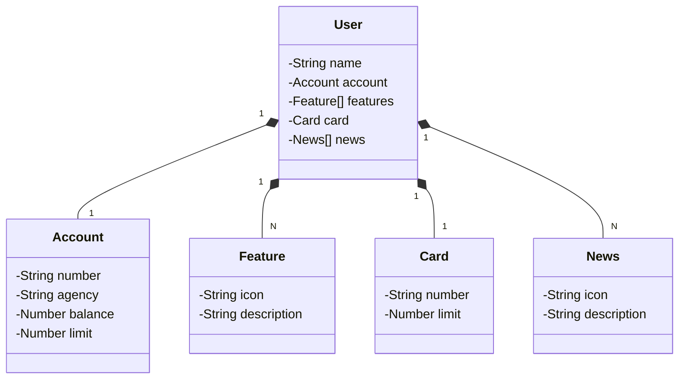

# API REST with Public Cloud
RESTful API created for the DIO project challenge "Publishing Your REST API to the Cloud Using Spring Boot 3, Java 17 and Railway".

## Key Technologies
- **Java 17**: We're using the latest Long-Term Support (LTS) version of Java to take advantage of its robust features and latest innovations;
- **Spring Boot 3**:  This project utilizes Spring Boot 3, which streamlines development through its powerful auto-configuration capabilities;
- **Spring Data JPA**: We'll leverage Spring Data JPA to simplify data access and integration with SQL databases;
- **OpenAPI (Swagger)**: Our API documentation will be generated using OpenAPI (Swagger), ensuring clarity and alignment with Spring Boot's productivity focus;
- **Railway**: We're relying on Railway for streamlined cloud deployment, monitoring, and access to various database-as-a-service options and CI/CD pipelines.

## Interface Project
O [Penpot](https://penpot.app/) was the tool used to design the application's UI.

## Class Diagram (API Domain)

